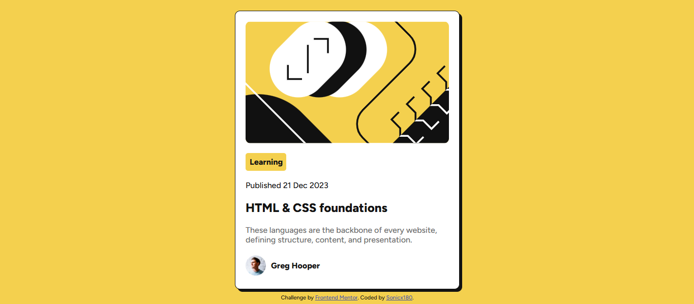

# Frontend Mentor - Blog preview card solution

This is a solution to the [Blog preview card challenge on Frontend Mentor](https://www.frontendmentor.io/challenges/blog-preview-card-ckPaj01IcS). Frontend Mentor challenges help you improve your coding skills by building realistic projects. 

## Overview

### The challenge

Users should be able to:

- See hover and focus states for all interactive elements on the page

### Screenshot

### Links

- Solution URL: [https://github.com/sonicx180/blog-preview-card/](https://github.com/sonicx180/blog-preview-card/)
- Live Site URL: [https://sonicx180.github.io/blog-preview-card](https://sonicx180.github.io/blog-preview-card)

## My process

Build and check if responsive overtime
### Built with

- Semantic HTML5 markup
- Flexbox
- Mobile-first workflow

## Author
- Frontend Mentor - [@sonicx180](https://www.frontendmentor.io/profile/sonicx180)

